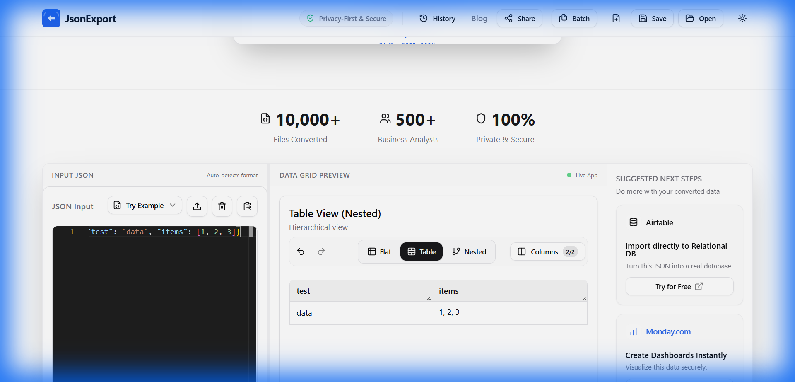
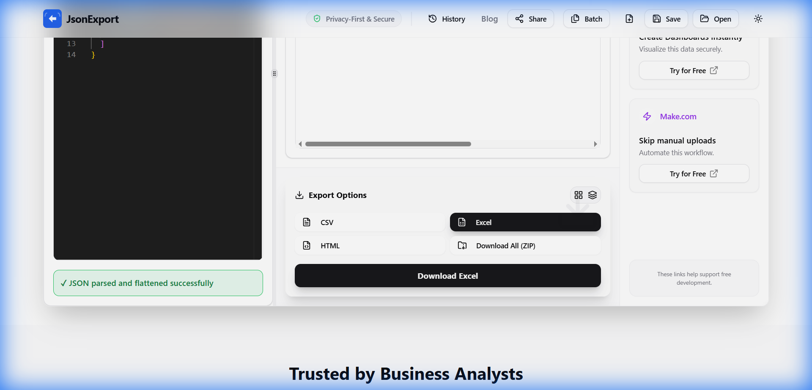
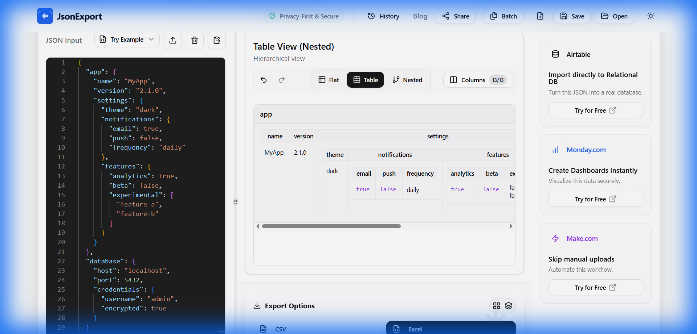

<div align="center">



# JsonExport

**The Smart JSON Bridge for Developers**

Convert complex, nested JSON to clean Excel/CSV spreadsheets instantly.  
Auto-Unescape • Smart Flattening • Privacy-First • 100% Client-Side

[](https://jsonexport.com)
[](https://github.com/theGoodB0rg/json_hub/stargazers)
[](LICENSE)
[](tests/)

</div>

---

## The Problem

Dealing with messy API responses? Complex nested JSON from databases? Double-encoded strings that break everything?

**JsonExport solves this:**

- Automatically detects and unescapes double/triple-encoded JSON
- Flattens deeply nested structures into spreadsheet-friendly rows
- Optimized for **API responses and large files** (100MB+)
- **100% client-side** - your data never leaves your browser

---

## Key Features

### Auto-Unescape Detection
Automatically handles double or triple-encoded JSON strings without manual intervention.

```javascript
// Input: "{\"name\":\"John\"}"
// Output: {name: "John"}
```

### Smart & Flattening
Converts nested structures to spreadsheet-friendly format using dot notation.

```javascript
// Input: {user: {address: {city: "NYC"}}}
// Output: {"user.address.city": "NYC"}
```

### Lightweight JSON Editor
Custom-built editor optimized for quick conversions with error highlighting and line numbers.

### Unified Inline Editing
Edit data directly in Flat, Table, or Nested views with full undo/redo support.

### Multiple Export Formats
Download as CSV, Excel (XLSX), HTML, or all formats in a single ZIP file.

### Column Management
Reorder, hide, and manage columns via intuitive drag & drop interface.

### Privacy-First Architecture
All processing happens in your browser. Zero network calls. No data upload.

### Growth Execution (Phase 4)
- UTM source-aware landing banner for campaign traffic (`utm_source=producthunt`, `g2`, `capterra`, etc.)
- Social proof badges in footer with safe fallback when listing URLs are not configured
- Conversion telemetry events for parse/export plus growth interactions (campaign detect, badge clicks, affiliate toast shown/clicked)

---

## Screenshots

<table>
<tr>
<td width="50%">

### Export Options


</td>
<td width="50%">

### Data Grid Preview


</td>
</tr>
</table>

---

## Perfect For

- Converting **Stripe API responses** to Excel for analysis
- Flattening **Shopify webhook data** to CSV
- Transforming **MongoDB exports** to spreadsheets
- Parsing **double-encoded JSON strings** from legacy systems
- Handling **deeply nested objects** from REST APIs
- Processing **API responses and large JSON exports** (100MB+)
- **Database export analysis** and reporting
- **JSON to Excel converter** with intelligent auto-unescape
- **API response visualization** in table format

---

## Quick Start

### Online (Recommended)

**[Launch JsonExport →](https://jsonexport.com)**

No installation needed. Works 100% in your browser.

### Local Development

```bash
# Clone the repository
git clone https://github.com/theGoodB0rg/json_hub.git
cd json_hub

# Install dependencies
npm install

# Start development server
npm run dev

# Open http://localhost:3000
```

Optional growth link configuration for local testing:

```bash
NEXT_PUBLIC_PRODUCT_HUNT_URL=https://www.producthunt.com/products/your-product-slug
NEXT_PUBLIC_G2_URL=https://www.g2.com/products/your-product/reviews
NEXT_PUBLIC_CAPTERRA_URL=https://www.capterra.com/p/your-product-id/
```

---

## How It Works

1. **Input JSON**: Paste JSON or upload a file (drag & drop supported)
2. **Auto-Parse**: Automatically detects and unescapes encoded strings
3. **Smart Flatten**: Converts nested structures to tabular format
4. **Edit & Review**: Inline editing in your preferred view (Flat/Table/Nested)
5. **Export**: Download as CSV, Excel, HTML, or all in a ZIP

---

## Tech Stack

| Category | Technology |
|----------|-----------|
| **Framework** | Next.js 14 (App Router, Static Export) |
| **Language** | TypeScript |
| **Styling** | Tailwind CSS + Shadcn/UI |
| **State** | Zustand + Zundo (Temporal) |
| **Editor** | Custom Lightweight |
| **Table** | TanStack Table v8 + @dnd-kit |
| **Export** | SheetJS (xlsx), JSZip |
| **Testing** | Jest + Playwright |

---

## Project Structure

```
json_hub/
├── app/                    # Next.js app directory
│   ├── layout.tsx         # Root layout with SEO
│   └── page.tsx           # Main converter page
├── components/            # React components
│   ├── JsonEditor/       # Monaco editor wrapper
│   ├── DataGrid/         # Table preview with editing
│   └── ExportMenu/       # Export controls
├── lib/
│   ├── parsers/          # Core parsing logic
│   │   ├── smartParse.ts # JSON validator with auto-unescape
│   │   └── flattener.ts  # Nested object flattener
│   ├── converters/       # Export converters
│   │   ├── jsonToCsv.ts
│   │   ├── jsonToXlsx.ts
│   │   ├── jsonToHtml.ts
│   │   └── zipExporter.ts
│   └── store/            # Zustand state management
└── types/                # TypeScript type definitions
```

---

## Testing

```bash
# Run unit tests
npm test

# Run tests in watch mode
npm test -- --watch

# Run E2E tests
npm run test:e2e

# Build for production
npm run build
```

### Test Coverage

- **smartParse**: 20/20 tests (100%)
- **flattener**: 21/21 tests (100%)
- **converters**: 11/12 tests (92%)
- **Overall**: 52/53 tests (98%)

---

## Deployment

### GitHub Pages (Current)

This repository uses GitHub Actions for automatic deployment:

1. Push to `main` branch
2. GitHub Actions builds and deploys automatically
3. Live at [jsonexport.com](https://jsonexport.com)

### Vercel (Alternative)

Connect your fork to Vercel for instant deployments with preview URLs.

---

## How JsonExport Compares

| Feature | JsonExport | Online Converters | Excel Manual |
|---------|------------|-------------------|--------------|
| Auto-Unescape | ✓ Automatic | ✗ Manual | ✗ Not possible |
| Privacy | ✓ Client-side | ⚠️ Server upload | ✓ Local |
| File Size | ✓ 100MB+ (Streaming) | ✗ Usually 5MB | ✓ Unlimited |
| Inline Editing | ✓ All views | ✗ No editing | ✓ Yes |
| Undo/Redo | ✓ Full history | ✗ None | ⚠️ Limited |
| Cost | ✓ Free | 💰 Often paid | ✓ Free |

---

## Contributing

Contributions are welcome! Please see [CONTRIBUTING.md](CONTRIBUTING.md) for guidelines.

1. Fork the repository
2. Create your feature branch (`git checkout -b feature/AmazingFeature`)
3. Commit your changes (`git commit -m 'Add AmazingFeature'`)
4. Push to the branch (`git push origin feature/AmazingFeature`)
5. Open a Pull Request

---

## Security

All processing happens client-side. Your data never leaves your browser. See [SECURITY.md](SECURITY.md) for our security policy.

---

## License

This project is licensed under the MIT License - see the [LICENSE](LICENSE) file for details.

---

## Acknowledgments

Built with amazing open-source tools:

- [Monaco Editor](https://microsoft.github.io/monaco-editor/) by Microsoft
- [TanStack Table](https://tanstack.com/table) by Tanner Linsley
- [TanStack Virtual](https://tanstack.com/virtual) for virtualization
- [@streamparser/json](https://www.npmjs.com/package/@streamparser/json) for streaming large files
- [SheetJS](https://sheetjs.com/) for Excel export
- [Shadcn/UI](https://ui.shadcn.com/) for beautiful components

---

## Keywords

`json to excel` • `json to csv` • `json converter` • `flatten json` • `nested json to table` • `json parser` • `unescape json` • `json flattener` • `api response to spreadsheet` • `mongodb export to excel` • `stripe json converter` • `shopify json to csv`

---

<div align="center">

[](https://github.com/theGoodB0rg)
[](https://twitter.com/intent/tweet?text=Check%20out%20JsonExport%20-%20Convert%20complex%20JSON%20to%20Excel/CSV%20instantly!&url=https://github.com/theGoodB0rg/json_hub)

**[🌐 Live Demo](https://jsonexport.com)** • **[📖 Documentation](https://github.com/theGoodB0rg/json_hub/wiki)** • **[🐛 Report Bug](https://github.com/theGoodB0rg/json_hub/issues)** • **[💡 Request Feature](https://github.com/theGoodB0rg/json_hub/discussions)**

**⭐ Star this repository to support the project!**

Made with ❤️ for developers dealing with messy JSON

</div>
