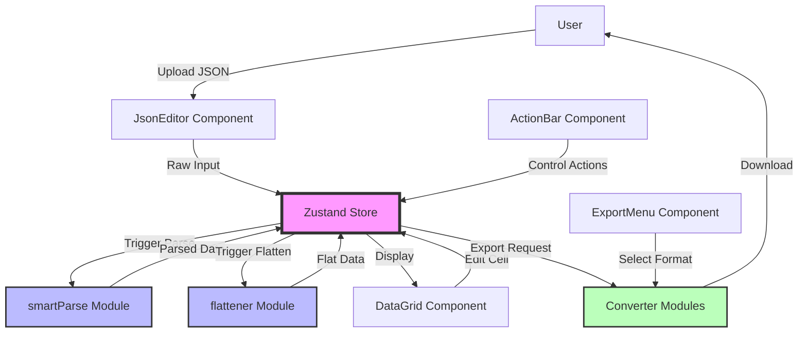
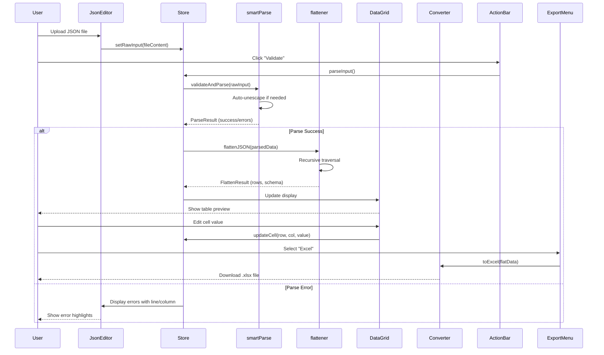
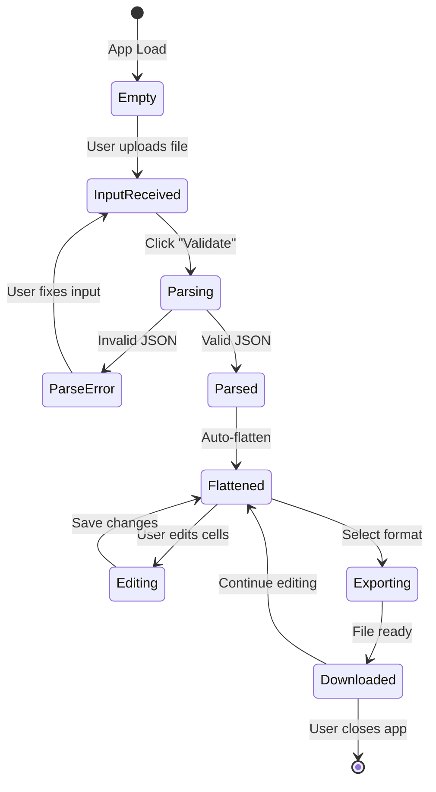

# JSON Hub - Technical Architecture

## System Overview

**The Smart JSON Bridge** is a client-side Single Page Application (SPA) that processes JSON data entirely in the browser. This architecture ensures:
- **Zero hosting costs** (static deployment on Vercel Free Tier)
- **Complete data privacy** (no server-side processing)
- **Maximum performance** (no network latency for processing)
- **Offline capability** (Service Worker caching)

---

## Component Architecture

### High-Level Component Diagram



### Component Responsibilities

#### UI Components
- **JsonEditor**: File upload, drag-and-drop, Monaco Editor integration
- **ActionBar**: Validation controls, formatting toggles, status indicators
- **DataGrid**: Virtualized table, cell editing, keyboard navigation
- **ExportMenu**: Format selection, download triggers, progress indicators

#### Core Logic Modules
- **smartParse**: JSON validation, auto-unescape, error reporting
- **flattener**: Nested object flattening, schema inference
- **Converters**: Format-specific export logic (CSV, Excel, Word, HTML, ZIP)

#### State Management
- **Zustand Store**: Global state for raw input, parsed data, flat data, UI state

---

## Data Flow

### Processing Pipeline



### State Transitions



---

## State Management

### Zustand Store Schema

```typescript
interface AppState {
  // ===== Input State =====
  rawInput: string;                    // Original user input
  isParsed: boolean;                   // Parse success flag
  parseErrors: ParseError[];           // Detailed error messages
  
  // ===== Processed Data =====
  parsedData: any;                     // Raw parsed JSON
  flatData: Record<string, any>[];     // Flattened rows
  schema: string[];                    // Column headers
  
  // ===== UI State =====
  activeTab: 'input' | 'preview' | 'export';
  selectedFormat: 'csv' | 'xlsx' | 'docx' | 'html' | 'zip';
  isLoading: boolean;
  downloadProgress: number;            // 0-100 for large exports
  
  // ===== Configuration =====
  prettyPrint: boolean;                // JSON formatting toggle
  rowLimit: number;                    // Max rows to display (performance)
  fileSizeLimit: number;               // Max upload size (10MB)
  
  // ===== Actions =====
  setRawInput: (input: string) => void;
  parseInput: () => void;
  flattenData: () => void;
  updateCell: (rowIndex: number, column: string, value: any) => void;
  exportData: (format: string) => void;
  resetState: () => void;
}
```

### Why Zustand?
- **Minimal boilerplate** compared to Redux
- **No context providers** needed (simpler component tree)
- **Built-in TypeScript support**
- **Devtools integration** for debugging
- **Small bundle size** (~1KB)

---

## File Structure

```
json_hub/
├── src/
│   ├── app/
│   │   ├── page.tsx                    # Main application page
│   │   ├── layout.tsx                  # Root layout with metadata
│   │   └── globals.css                 # Global styles
│   │
│   ├── components/
│   │   ├── ui/                         # Shadcn/UI components
│   │   │   ├── button.tsx
│   │   │   ├── card.tsx
│   │   │   ├── toast.tsx
│   │   │   └── resizable.tsx
│   │   │
│   │   ├── JsonEditor/
│   │   │   ├── JsonEditor.tsx          # Monaco Editor wrapper
│   │   │   ├── FileUpload.tsx          # Drag-and-drop zone
│   │   │   └── ErrorDisplay.tsx        # Parse error viewer
│   │   │
│   │   ├── DataGrid/
│   │   │   ├── DataGrid.tsx            # TanStack Table wrapper
│   │   │   ├── VirtualizedTable.tsx    # Virtualization logic
│   │   │   └── CellEditor.tsx          # Inline cell editing
│   │   │
│   │   ├── ActionBar/
│   │   │   ├── ActionBar.tsx           # Control toolbar
│   │   │   └── StatusIndicator.tsx     # Validation status
│   │   │
│   │   └── ExportMenu/
│   │       ├── ExportMenu.tsx          # Download dropdown
│   │       └── ProgressBar.tsx         # Export progress
│   │
│   ├── lib/
│   │   ├── parsers/
│   │   │   ├── smartParse.ts           # JSON validation + auto-unescape
│   │   │   ├── smartParse.test.ts
│   │   │   ├── flattener.ts            # Nested object flattening
│   │   │   └── flattener.test.ts
│   │   │
│   │   ├── converters/
│   │   │   ├── jsonToCsv.ts            # CSV export
│   │   │   ├── jsonToCsv.test.ts
│   │   │   ├── jsonToXlsx.ts           # Excel export
│   │   │   ├── jsonToXlsx.test.ts
│   │   │   ├── jsonToDocx.ts           # Word export
│   │   │   ├── jsonToHtml.ts           # HTML export
│   │   │   ├── zipExporter.ts          # ZIP bundling
│   │   │   └── zipExporter.test.ts
│   │   │
│   │   ├── store/
│   │   │   └── store.ts                # Zustand global state
│   │   │
│   │   └── utils/
│   │       ├── fileValidation.ts       # File size/type checks
│   │       └── downloadHelper.ts       # Blob download utility
│   │
│   └── types/
│       ├── parser.types.ts             # Parser interfaces
│       ├── converter.types.ts          # Converter interfaces
│       └── store.types.ts              # Store interfaces
│
├── public/
│   ├── service-worker.js               # Offline support
│   └── manifest.json                   # PWA manifest
│
├── e2e/
│   ├── happy-path.spec.ts              # E2E test: upload → export
│   ├── error-handling.spec.ts          # E2E test: malformed JSON
│   └── performance.spec.ts             # E2E test: large datasets
│
├── .github/
│   └── workflows/
│       └── ci.yml                      # GitHub Actions CI/CD
│
├── jest.config.js                      # Jest configuration
├── playwright.config.ts                # Playwright configuration
├── next.config.js                      # Next.js configuration
├── tailwind.config.js                  # Tailwind CSS configuration
├── tsconfig.json                       # TypeScript configuration
└── package.json                        # Dependencies
```

---

## Technology Stack Rationale

### Framework: Next.js (App Router)
**Why?**
- **Static export** for $0 hosting on Vercel
- **Built-in TypeScript** support
- **Optimized bundling** with webpack/turbopack
- **SEO-friendly** (even though this is a tool, not content)
- **Easy deployment** (one command to Vercel)

**Alternatives Considered**:
- Vite + React: More manual setup, no built-in routing
- Create React App: Deprecated, slower builds

---

### Language: TypeScript
**Why?**
- **Catch bugs at compile time** (e.g., wrong data types in state)
- **Better IDE support** (autocomplete, refactoring)
- **Self-documenting code** (interfaces serve as documentation)
- **Easier maintenance** (refactoring is safer)

---

### Styling: Tailwind CSS + Shadcn/UI
**Why?**
- **Utility-first** approach speeds up development
- **Shadcn/UI** provides accessible, customizable components
- **No runtime CSS-in-JS** overhead (unlike styled-components)
- **Consistent design system** out of the box

---

### State: Zustand
**Why?**
- **Simpler than Redux** (less boilerplate)
- **No context providers** (cleaner component tree)
- **TypeScript-first** design
- **Small bundle size** (~1KB vs Redux ~3KB)

**Alternatives Considered**:
- Redux: Too much boilerplate for this app
- Context API: Performance issues with frequent updates

---

### Table: TanStack Table v8
**Why?**
- **Built-in virtualization** (critical for 100K+ rows)
- **Headless UI** (full control over styling)
- **TypeScript-first** design
- **Excellent performance** (only renders visible rows)

**Alternatives Considered**:
- ag-grid: Heavier bundle, less customizable
- react-window: Lower-level, more manual work

---

### Editor: Monaco Editor
**Why?**
- **Same editor as VS Code** (familiar to developers)
- **Syntax highlighting** for JSON
- **Error squiggles** (visual feedback for parse errors)
- **Professional appearance**

**Alternatives Considered**:
- CodeMirror: Good, but Monaco has better TypeScript support
- Plain textarea: No syntax highlighting

---

## Performance Optimizations

### 1. Table Virtualization
**Problem**: Rendering 100K rows freezes the browser  
**Solution**: TanStack Table only renders visible rows (~20 at a time)  
**Impact**: 100K rows render in <3 seconds instead of crashing

### 2. Web Workers (Future Enhancement)
**Problem**: Flattening large datasets blocks the main thread  
**Solution**: Move `flattener.ts` logic to Web Worker  
**Impact**: UI stays responsive during processing

### 3. Lazy Loading Monaco Editor
**Problem**: Monaco Editor is ~2MB (large initial bundle)  
**Solution**: Code-split with `next/dynamic` and load on demand  
**Impact**: Faster initial page load

### 4. Service Worker Caching
**Problem**: App reloads slowly on repeat visits  
**Solution**: Cache static assets (JS, CSS, fonts) with Service Worker  
**Impact**: Instant load on repeat visits

### 5. Memoization in Flattener
**Problem**: Repeated nested structures cause redundant work  
**Solution**: Cache flattened results for identical objects  
**Impact**: 2-3x faster for datasets with repeated structures

---

## Security Considerations

### 1. Client-Side Only Processing
**Benefit**: No data leaves the user's browser  
**Implication**: No server-side vulnerabilities (XSS, SQL injection, etc.)

### 2. File Size Limits
**Threat**: Malicious user uploads 1GB file to crash browser  
**Mitigation**: Enforce 10MB upload limit with graceful error message

### 3. Circular Reference Detection
**Threat**: Malicious JSON with circular refs causes infinite loop  
**Mitigation**: `smartParse.ts` detects circular refs and returns error

### 4. Content Security Policy (CSP)
**Threat**: XSS attacks via injected scripts  
**Mitigation**: Set strict CSP headers in `next.config.js`

### 5. Dependency Auditing
**Threat**: Vulnerable npm packages  
**Mitigation**: Run `npm audit` before each deployment

---

## Deployment Strategy

### Hosting: Vercel Free Tier
**Why?**
- **$0 cost** for static sites
- **Global CDN** (fast worldwide)
- **Automatic HTTPS**
- **One-command deployment** (`vercel deploy`)

### CI/CD: GitHub Actions
**Workflow**:
1. Developer pushes to `main` branch
2. GitHub Actions runs:
   - `npm run test` (Jest unit tests)
   - `npm run test:e2e` (Playwright E2E tests)
   - `npm run build` (TypeScript compilation)
   - `npm run lint` (ESLint checks)
3. If all pass, auto-deploy to Vercel
4. If any fail, block deployment and notify developer

### Error Monitoring: Sentry
**Setup**:
- Add Sentry SDK to `app/layout.tsx`
- Capture unhandled errors and promise rejections
- Track user sessions for debugging

**Alerts**:
- Email on new error types
- Slack notification for high error rates

---

## Accessibility Compliance

### WCAG 2.1 AA Requirements

#### Keyboard Navigation
- ✅ All buttons accessible via Tab
- ✅ Table navigation with arrow keys
- ✅ Modal dialogs trap focus
- ✅ Skip links for screen readers

#### Screen Reader Support
- ✅ ARIA labels on all interactive elements
- ✅ ARIA live regions for dynamic content (e.g., "Parsing complete")
- ✅ Semantic HTML (`<table>`, `<button>`, `<nav>`)

#### Color Contrast
- ✅ Minimum 4.5:1 contrast ratio for text
- ✅ Error messages use icons + color (not color alone)

#### Focus Indicators
- ✅ Visible focus outlines on all interactive elements
- ✅ Custom focus styles for better visibility

---

## Testing Strategy

### Unit Tests (Jest)
**Coverage Target**: 80%+ on core logic  
**Focus Areas**:
- Parser logic (`smartParse.ts`)
- Flattener logic (`flattener.ts`)
- Converter functions (`jsonToCsv.ts`, etc.)

### E2E Tests (Playwright)
**Coverage**: All user workflows  
**Focus Areas**:
- Upload → Preview → Download
- Error handling for malformed JSON
- Mobile responsiveness
- Keyboard navigation

### Performance Tests
**Benchmarks**:
- 100K row dataset flattens in <2 seconds
- Table renders in <3 seconds
- Memory usage stays below 500MB

### Accessibility Tests
**Tools**: axe DevTools, Lighthouse  
**Target**: 90+ Lighthouse accessibility score

---

## Future Enhancements

### Phase 5 (Post-MVP)
- **Web Worker for flattening** (keep UI responsive)
- **Custom column mapping** (user-defined header names)
- **Filter/search in table** (find specific rows)
- **Dark mode** (user preference)
- **Export templates** (save custom export settings)
- **Batch processing** (upload multiple files at once)

---

*This architecture is designed for scalability, maintainability, and professional-grade quality.*
